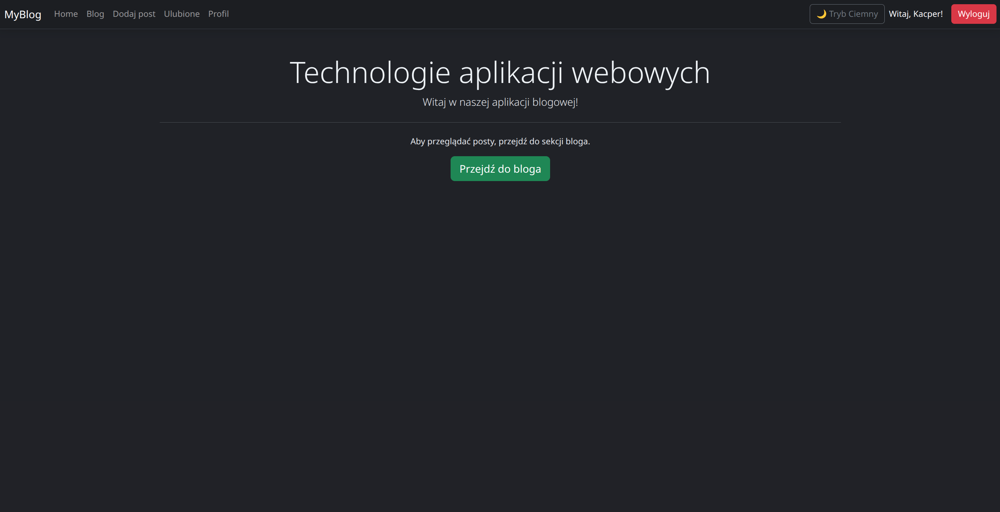
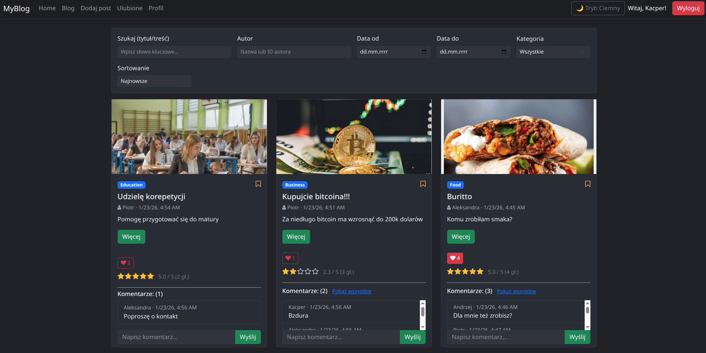
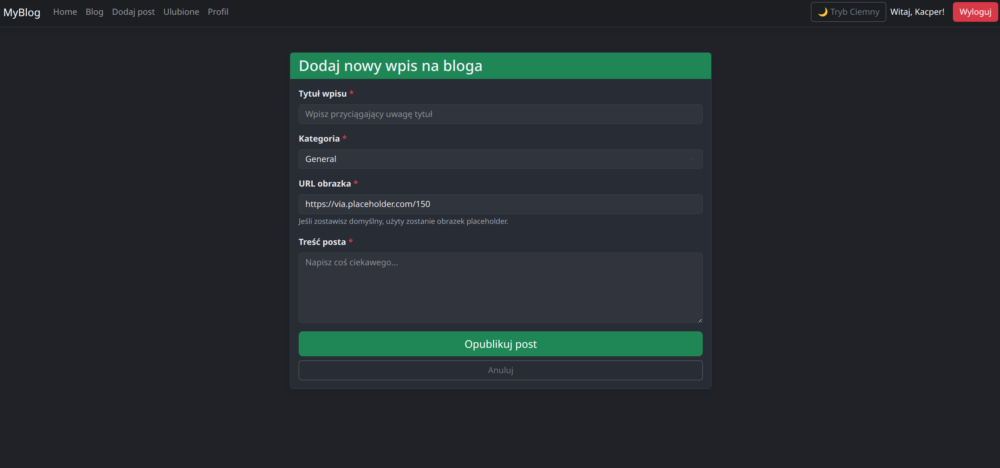
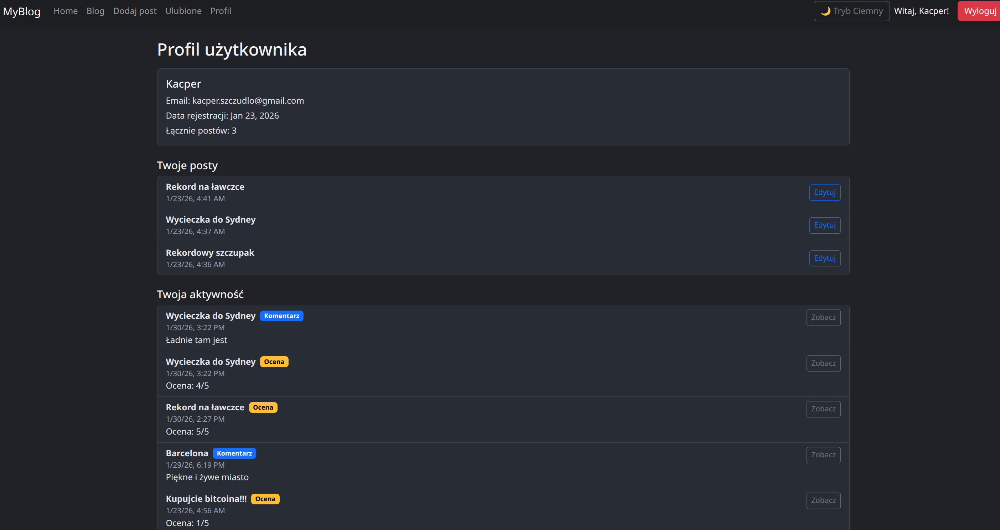

# MEAN Blog


Blog full-stack (MongoDB, Express, Angular, Node.js) z JWT, CRUD postów, komentarzami, lajkami, ocenami, ulubionymi, kategoriami, paginacją oraz trybem jasnym/ciemnym.

## Live Demo
- **Frontend:** https://mean-blog-app.vercel.app
- **Backend API:** https://mean-blog-app-x0di.onrender.com/api

## Screenshots

### Home


### Blog / lista postów + filtry


### Dodawanie posta


### Profil


## Wymagania
- Node.js 18+
- npm
- MongoDB (URI: Atlas lub lokalnie)

## Szybki start
1) Backend
```
cd mean-app
npm install
npm start        # http://localhost:3000
```
Ustaw: `MONGODB_URI`, `JWT_SECRET` (lub edytuj lib/config.ts).

2) Frontend
```
cd angular
npm install
npm start        # http://localhost:4200
```

## Funkcje
- Auth: rejestracja/logowanie (JWT), guard, interceptor nagłówka.
- Blog: tworzenie/edycja/usuwanie (autor), kategorie, paginacja, **zaawansowane wyszukiwanie** (fraza tytuł/treść), filtr daty, autor, kategoria, sort (data, popularność, ocena), podświetlanie wyników.
- Interakcje: komentarze, 1 like na użytkownika, oceny 1–5 z uśrednieniem, ulubione (lokalnie) z osobnym widokiem.
- Profil: dane użytkownika, data rejestracji, liczba i lista własnych postów, historia aktywności; edycja postów z profilu.
- UI: responsywny layout (Bootstrap grid, navbar z hamburgerem), tryb jasny/ciemny.
